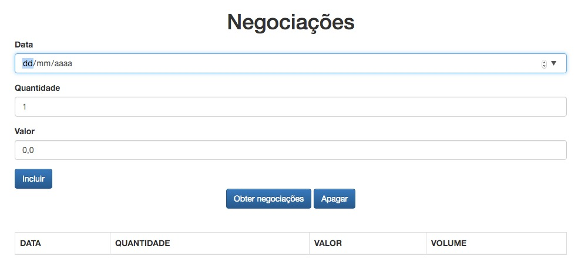

# Negociações

## Visão geral do projeto
Neste projeto para estudo de javascript foi-se criado um cadastro de negociações de bolsa de valores. Cadastraremos novas negociações, inclusive, elas serão importadas de serviços especializados, tudo aplicando o paradigma funcional e orientado a objetos ao, mesmo tempo, utilizando o melhor dos dois mundos.

Em um primeiro momento, o escopo da nossa aplicação pode parecer bem reduzido, mas é o suficiente para aplicarmos novos recursos da linguagem JavaScript, ou ECMAScript 2015 (ES6), tecnicamente falando. Além disso, organizaremos nosso código no modelo MVC (M**odel-View-C*ontroller), aplicaremos padrões de projeto, programaremos assincronamente com *promises, renderizaremos templates e trabalharemos com proxies, entre outras coisas.

## Tecnologias
O projeto foi criado com:
* Javascript
* HTML5
* Bootstrap

## Setup
No terminal do seu projeto, execute o comando:

`npm install`

Depois, basta baixar o projeto e abrir o arquivo `index.html` em seu browser.

font: 'https://cursos.alura.com.br/course/javascript-es6-orientacao-a-objetos-parte-1/'
